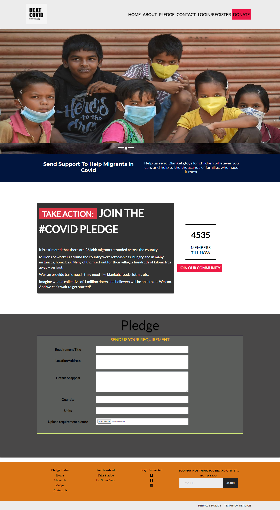
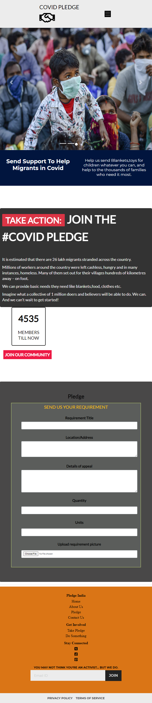
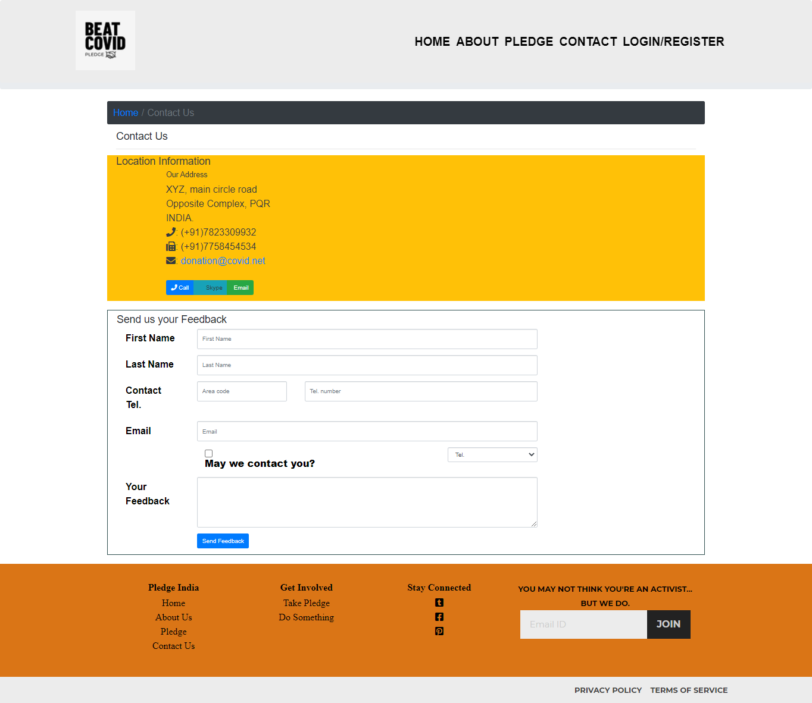

# Covid-Donation-Pledge
A Django framework based web portal allows people who are willing to donate necessary needs required by people and pledge to their requests.
To run this web app you need to install python and django in your computer.
* open terminal in this folder and type python manage.py runserver.
* visit 127.0.0.1:8000 in your browser.
# Screenshots
# DesktopView-Home

# MobileView-Home

# Contacts

